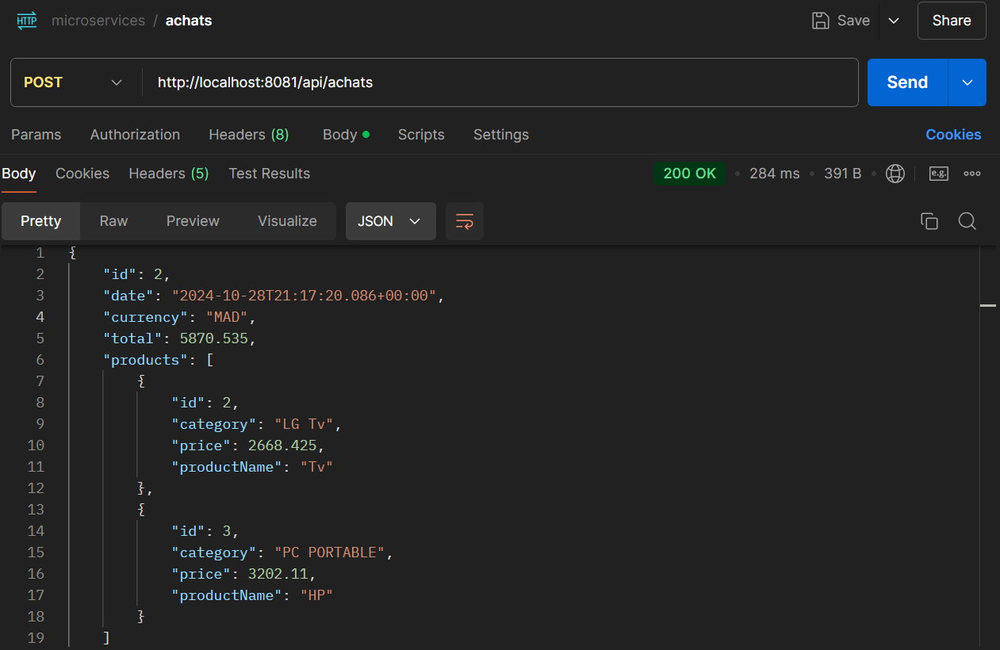
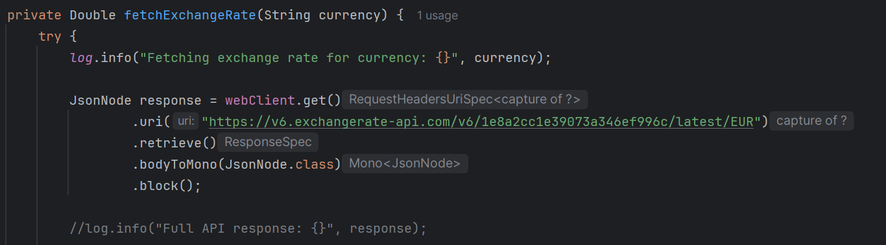

# Microservices Spring Boot - Produits et Achats avec Conversion de Devise

Ce projet contient deux microservices Spring Boot, `Produits` et `Achats`, qui permettent de gérer des produits avec la possibilité de faire des achats dans différentes devises. Le microservice `Achats` utilise l'[API Exchange Rate](https://v6.exchangerate-api.com/v6/09e2061b8a8a2bbbec7d8108/latest/USD) pour la conversion en temps réel des devises.

## Table des Matières
1. [Aperçu du Projet](#aperçu-du-projet)
2. [Aperçu des Microservices](#aperçu-des-microservices)
3. [Fonctionnalités](#fonctionnalités)
4. [Technologies Utilisées](#technologies-utilisées)
5. [Captures d'Écran](#captures-décran)
6. [Endpoints de l'API](#endpoints-de-lapi)

---

## Aperçu du Projet
Le projet est structuré en deux principaux dossiers :
- **achat** : Contient le microservice de gestion des achats.
- **products** : Contient le microservice de gestion des produits.

Ces microservices permettent de gérer les produits en EUR et d'effectuer des achats dans différentes devises, en utilisant `WebClient` pour la communication entre les services et la récupération des taux de change en temps réel.

## Aperçu des Microservices

### 1. Microservice Produits
- **Port** : `8080`
- **Description** : Gère les opérations CRUD (Créer, Lire, Mettre à jour, Supprimer) pour les produits.
- **Endpoints** :
  - `POST api/produits` : Créer un nouveau produit
  - `GET api/produits` : Récupérer tous les produits
  - `GET api/produits/{id}` : Récupérer un produit par ID
  - `PUT api/produits/{id}` : Mettre à jour un produit existant
  - `DELETE api/produits/{id}` : Supprimer un produit par ID

### 2. Microservice Achats
- **Port** : `8081`
- **Description** : Permet aux utilisateurs d'acheter des produits dans différentes devises. Le montant total est calculé en fonction des taux de change en temps réel.
- **Endpoints** :
  - `POST api/achats/convert` : Convertir un montant dans une autre devise en fournissant l'ID des produits et la devise souhaitée. Le service récupère les détails des produits via le microservice `Produits` et utilise l'API Exchange Rate pour la conversion.

## Fonctionnalités
- **Support de Devises** : Les prix des produits sont en EUR par défaut, mais peuvent être convertis en d'autres devises en temps réel.
- **Communication Inter-Microservices** : Le microservice `Achats` communique avec `Produits` pour récupérer les informations des produits et utilise l'API Exchange Rate pour les taux de change en temps réel.
- **WebClient** : Utilisé pour l'intégration réactive et non bloquante entre les microservices et avec l'API externe.

## Technologies Utilisées
- **Spring Boot** : Pour le développement des microservices.
- **Spring WebFlux** : Pour la communication réactive avec `WebClient`.
- **Spring Data JPA** : Gestion des opérations de base de données dans `Produits`.
- **H2 Database** : Base de données en mémoire pour le développement et les tests.
- **Exchange Rate API** : Service tiers pour la conversion des devises en temps réel.

## Captures d'Écran

### 1. Création d'un Nouveau Produit

### 2. Liste des Produits

### 3. Requête pour un Achat avec Conversion de Devise

### 4. Résultat de l'Achat avec Conversion de Devise

### 5. Quota de l'API Exchange Rate

### 6. Methode pour integrer l'API Exchange Rate

### 7. Tables de Base de Données

#### Table des Achats

#### Table d'Association Achat-Produits

#### Table des Produits

## Endpoints de l'API

### Microservice Produits (Port 8080)
| Méthode | Endpoint                     | Description                    |
|---------|------------------------------|--------------------------------|
| POST    | `api/produits`               | Créer un nouveau produit       |
| GET     | `api/produits`               | Récupérer tous les produits    |
| GET     | `api/produits/{id}`          | Récupérer un produit par ID    |
| PUT     | `api/produits/{id}`          | Mettre à jour un produit       |
| DELETE  | `api/produits/{id}`          | Supprimer un produit par ID    |

### Microservice Achats (Port 8081)
| Méthode | Endpoint                     | Description                        |
|---------|------------------------------|------------------------------------|
| POST    | `/api/achats`        | Convertir un montant dans une autre devise en fonction des taux de change actuels |

---
